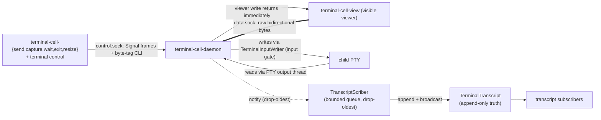

# terminal-cell - architecture

*Daemon-owned child PTY with two clearly separated wire planes: a Signal
control plane and a raw byte data plane. Viewer latency lives off the actor
mailbox; transcript work lives off the viewer path.*

---

## 0 · TL;DR

A `terminal-cell-daemon` owns one child process group and one PTY for the
lifetime of the session. Around that PTY sit two distinct Unix listeners:



The control plane is `signal-terminal`. The data plane is a raw byte
pump with only enough framing for attach handshake, detach, resize, exit, and
explicit accept/reject. Neither plane mode-shifts into the other: an attach
request on `control.sock` is rejected with a typed `ATTACH_REJECTED` reply
before any byte transport begins; any non-attach request on `data.sock` is
rejected with the symmetric reply.

Three properties are load-bearing and tested with witnesses:

- **Viewer latency.** Live viewer bytes (`data.sock`) never traverse a Kameo
  actor mailbox. PTY output reaches the viewer through `ViewerFanout`, a
  blocking worker that writes and returns; transcript work happens on a
  separate `TranscriptScriber` worker fed by a bounded notification queue.
- **Transcript decoupling.** A slow transcript subscriber cannot back pressure
  into the viewer path. The scriber's queue drops the oldest pending bytes
  under overflow rather than blocking the viewer fanout.
- **Plane isolation.** `control.sock` and `data.sock` are separate Unix
  listeners bound at daemon startup; the daemon rejects cross-plane traffic on
  each socket with a typed reply before any bytes cross.

Production Persona consumes `terminal-cell` as a library inside the
consolidated `terminal-daemon`. The standalone `terminal-cell-daemon`
remains the local development and stateful-test harness for this primitive; it
is not the Persona engine boundary.

## 1 · Ownership

The daemon owns the child process group, PTY, sockets, and session lifecycle.
Command-line tools and GUI frontends are clients.

This component has no Sema database. A running session is discoverable through
its runtime directory under `${XDG_RUNTIME_DIR:-/tmp}/terminal-cell/session-*`.
That directory holds **two distinct listeners** — `control.sock` and
`data.sock` — alongside pid files, `session.env`, `session.name`, and
diagnostic logs. The list and rename tools inspect or update those files; they
are a local convenience registry, not durable system truth.

### 1.1 · Control plane

`control.sock` (mode 0600) is the daemon's Signal endpoint. It accepts
length-prefixed `signal-terminal` frames and the byte-tag CLI
protocol used by local command-line tools. Every effect that lives across
time — prompt-pattern registration, input-gate leasing, write injection,
transcript capture, resize, worker-lifecycle subscription, wait conditions —
arrives here.

Production Persona control flows through `terminal`, which owns the
registry, prompt-pattern lifecycle, input-gate policy, injection decision, and
component Sema state. The wire between `terminal` and `terminal-cell`
is Signal on this control socket. Local command-line clients
(`terminal-cell-send`, `-capture`, `-wait`, `-exit`, `-resize`) speak the
byte-tag protocol on the same socket because they exist for human and test
ergonomics. Both encodings are control-plane only.

The stack the cell sits inside:

```text
terminal                registry, names, Sema state, lifecycle policy
signal-terminal         typed terminal requests and events
terminal-cell           one child process group, one PTY, raw attach primitive
viewer adapters         disposable visible windows around the terminal owner
persona-system          OS facts such as focus and window state
persona-harness         harness-specific prompts, usage probes, quota parsing
```

### 1.2 · Data plane

`data.sock` (mode 0600) is the raw byte plane. It accepts an `Attach` request,
returns an explicit accept or reject, then carries raw bidirectional bytes
between the viewer terminal and the child PTY plus minimal framing for resize,
detach, and exit. Terminal escape interpretation, transcript replay, screen
projection, actor mailbox delivery, and wait conditions stay off this path.

```text
attach stdin  -> data.sock -> TerminalInputPort -> TerminalInputWriter -> child PTY
attach stdout <- data.sock <- ViewerFanout       <- PTY output thread  <- child PTY
```

The attached viewer's keyboard bytes reach the PTY through `TerminalInputPort`
+ `TerminalInputWriter` (the writer plane that owns the input gate).
Programmatic input enters the same `TerminalInputPort` with source provenance
`Programmatic` instead of `Viewer`. One PTY writer; one gate; two byte
sources.

The viewer write path is a blocking worker (`ViewerFanout`) sitting beside the
PTY output reader. It writes PTY output to the active viewer, then notifies
the transcript scriber over a bounded notification channel and returns. It
does not wait on transcript append, actor mailbox delivery, screen projection,
or subscribers.

Abduco is the concrete reference. Its client and server move `MSG_CONTENT`
packets between stdin/stdout, a Unix socket, and the child PTY; the other
packet kinds only describe attach, detach, resize, exit, and pid. It operates
on the raw byte stream and does not parse terminal escape sequences.

### 1.3 · Plane isolation

The two sockets do not mode-shift between roles. The daemon's control listener
rejects an `Attach` request with a typed `ATTACH_REJECTED` reply before any
byte transport begins; the data listener rejects every non-`Attach` request
with the symmetric reply. A misrouted client receives a typed wire error, not
a stuck stream.

### 1.4 · Workers and the actor mailbox

The `TerminalCell` Kameo actor owns state that lives across time: transcript
truth, worker-lifecycle observation, transcript and worker-lifecycle
subscribers, resize authority, child-exit waiters, and transcript-text
waiters.

Blocking planes are named workers around the actor: `TerminalInputWriter`,
`ViewerFanout`, `TranscriptScriber`, the PTY output reader, the child-exit
watcher, the daemon socket accept loops (control and data), and the attach
connection pump. Each worker reports typed `TerminalWorkerLifecycle`
start/stop events to the actor so worker failure or shutdown becomes
actor-observable state without putting every terminal byte through the actor
mailbox.

The transcript fanout splits cleanly:

- **`ViewerFanout`** — real-time. PTY reader hands bytes to the active viewer
  write and returns to the read loop. It carries no transcript work.
- **`TranscriptScriber`** — decoupled. Receives a notification from
  `ViewerFanout` over a bounded queue and appends to the transcript
  asynchronously. The queue applies drop-oldest discipline so a slow scriber
  sheds load instead of pushing backpressure into the viewer path.

### 1.5 · Input gate

The PTY write path owns the input gate. Persona can temporarily close the
gate to attached human input, write an injected byte sequence, then reopen
the gate. This is writer arbitration, not terminal semantics: blocked human
bytes are either buffered in order or rejected with an explicit gate state,
while injected bytes are written contiguously to the child PTY. The gate
sits at the PTY writer, not in the viewer, so every frontend obeys the same
rule.

`AcquireInputGate` returns prompt state when a prompt pattern id is supplied.
`WriteInjection` rejects dirty-prompt leases by default. The prompt-pattern
registry in this repo is a witness aid for safe injection while
`terminal` evolves the production control surface; literal and regex
patterns are suffix checks, and trailing bytes after the last match make the
prompt dirty. It does not make `terminal-cell` a harness semantic parser.

### 1.6 · Single active viewer

One terminal cell has at most one active attached viewer. The active viewer
is the only human byte source for the cell. A second attach request while a
viewer is active receives an explicit rejection before replay or live bytes
can cross. When the active viewer disconnects, the daemon keeps the child
PTY alive; a later viewer can reattach, receive transcript replay, and
continue sending input.

### 1.7 · Subscription lifecycle

Subscriptions over `control.sock` use a four-step lifecycle:

1. **Subscribe.** Client sends a typed subscribe request (e.g.
   `SubscribeTranscript`, `SubscribeTerminalWorkerLifecycle`).
2. **Initial state.** Server emits the current state as the first event.
3. **Deltas.** Server emits typed events as state changes.
4. **Close.** Client sends a typed retract/close request for the subscription
   token; server emits a final acknowledgement event and the stream ends.

Raw socket close is not semantic protocol. A consumer that wants to stop
receiving events sends the retract; the server's final event is the visible
end of the stream.

## 2 · Components

- `TerminalCell` — Kameo actor that owns transcript truth, worker-lifecycle
  observation, transcript and worker-lifecycle subscribers, resize authority,
  child-exit state, and waiters.
- `TerminalTranscript` — append-only output log sequenced by
  `TerminalSequence`.
- `TerminalOutputPort` — typed ingress to the viewer fanout used by the
  daemon attach path.
- `ViewerFanout` — blocking worker. Writes PTY output bytes to the active
  attached viewer and returns. Notifies `TranscriptScriber` over a bounded
  notification channel. Carries no transcript append work itself.
- `TranscriptScriber` — blocking worker. Receives `TranscriptNotice` over a
  bounded queue, appends bytes to the transcript via the actor, and emits
  transcript-delta broadcasts. The queue drops the oldest pending notice
  under overflow so a slow scriber sheds load rather than blocking
  `ViewerFanout`.
- `TerminalViewerLease` — active-viewer authority returned by the viewer
  fanout and released when the attach stream ends.
- `TranscriptSubscription` — replay plus live delta receiver for diagnostics.
- `ScreenProjection` — derived `vt100` snapshot over transcript bytes.
- `TerminalInput` — raw bytes plus source provenance, written to the PTY.
- `TerminalInputPort` — typed ingress to the PTY writer.
- `TerminalInputWriter` — blocking PTY writer plane that owns the input gate
  and serializes all human and programmatic bytes.
- `TerminalWorkerLifecycle` / `TerminalWorkerObservation` — actor-recorded
  lifecycle state for blocking PTY, fanout, scriber, and daemon workers.
- `TerminalInputGateLease` — writer-side lease proving human input is closed
  before a programmatic injection sequence.
- `TerminalInputGateRelease` — writer-side release record naming the lease and
  how many held human bytes were flushed when the gate reopened.
- Prompt-pattern control — daemon-side registry used to check whether the
  transcript currently ends in a registered terminal-ready shape. Production
  ownership of pattern lifecycle belongs in `terminal`.
- Worker-lifecycle subscription — pushed initial worker snapshot plus live
  worker-lifecycle deltas over `signal-terminal`.
- `TerminalExit` — recorded child status.
- `TerminalCellSocketClient` — Unix-socket client used by command-line tools
  and viewers. Exposes `new(control_socket, data_socket)` for full clients and
  `for_control_only(control_socket)` for clients that never attach (capture,
  send, wait, exit, resize, resolve).
- `terminal-cell-daemon` — daemon that owns the `TerminalCell` actor and
  binds both `control.sock` and `data.sock` listeners.
- `TerminalControlPlaneLoop` / `TerminalControlConnection` — accept loop and
  connection handler for the control listener. Rejects `Attach` requests
  with `ATTACH_REJECTED_REPLY`.
- `TerminalDataPlaneLoop` / `TerminalDataConnection` — accept loop and
  connection handler for the data listener. Rejects every non-`Attach`
  request with `ATTACH_REJECTED_REPLY`.
- `terminal-cell-send` / `-capture` / `-wait` / `-exit` / `-resize` — thin
  command-line clients that take `--control-socket`.
- `terminal-cell-session-select` — runtime-directory selector that rejects a
  directory missing either `control.sock` or `data.sock` or any owning
  daemon process.
- `terminal-cell-view` — interactive attach client. Takes both
  `--control-socket` and `--data-socket`, sends one attach request, pumps
  stdin/stdout over the data stream, and forwards `SIGWINCH` to the daemon.
- `agent-terminal-fixture` — deterministic agent-like terminal process used
  by stateful witnesses.
- `output-flood-fixture` — deterministic high-volume output process used to
  prove attached input still reaches the child under output load.

## 3 · Constraints

Each line names an obligation the daemon must satisfy; each load-bearing
constraint has a witness in §4. The constraints split into groups for the
reader; the witness section names the test that proves each.

### 3.1 · Plane isolation

- `control.sock` and `data.sock` are separate Unix listeners bound at daemon
  startup; the daemon binds both before writing `SessionRegistration` or
  enabling client traffic.
- `control.sock` accepts Signal frames and the byte-tag CLI protocol; it
  rejects every `Attach` request with `ATTACH_REJECTED_REPLY` before any
  byte transport begins.
- `data.sock` accepts only an `Attach` request followed by the raw byte
  stream; it rejects every non-`Attach` request with `ATTACH_REJECTED_REPLY`.
- A misrouted client receives a typed wire rejection, not a stuck stream or
  silent confusion.
- There is no single-socket mode-shift path between control and data roles.
- The daemon applies mode 0600 to both `control.sock` and `data.sock`
  immediately after bind.

### 3.2 · Data-plane latency

- The live attach path is a raw byte transport with only minimal attach,
  detach, resize, exit, and accept/reject framing.
- Raw viewer bytes never traverse a Kameo actor mailbox.
- Live human keyboard bytes enter `TerminalInputPort` directly from the
  attach connection; they do not go through the actor mailbox.
- The live attach path does not wait on actor handlers, transcript append,
  screen projection, waiters, or Persona decisions.
- Viewer attach round-trip latency stays sub-200ms under transcript and
  worker load; an actor `ask` on the data-plane path would not meet that
  budget.
- Signal control on `control.sock` does not block viewer attach on
  `data.sock`. Viewer attach completes in under 10ms regardless of pending
  control frames.
- High-volume child output still reaches the attached viewer while
  transcript subscribers are slow.
- High-volume child output does not starve attached input: keyboard bytes
  sent through the attach stream still reach the child PTY promptly while
  output is flowing.

### 3.3 · Transcript decoupling

- Transcript append is decoupled from viewer write. `ViewerFanout` writes
  the active viewer and notifies `TranscriptScriber`; it does not append
  transcript itself.
- `TranscriptScriber` reads notifications from a bounded queue and drops
  the oldest pending notice on overflow. The scriber never back-pressures
  into the viewer path.
- A slow transcript subscriber does not block the attached viewer. Witness:
  1000 PTY output bytes arrive at the viewer in under 100ms despite 50ms
  per transcript append.
- A slow transcript subscriber does not block transcript append into the
  scriber's queue.

### 3.4 · Viewer authority

- A terminal cell admits one active attached viewer at a time.
- A second attach request while a viewer is active receives an explicit
  attach rejection before any replay or live output bytes cross.
- A rejected second viewer cannot send input to the child PTY.
- Closing the active viewer detaches only that viewer; it does not end the
  daemon-owned child PTY.
- Output emitted while no viewer is attached is still available to
  transcript capture.
- A late viewer may receive transcript replay before live attach; replay is
  not the live display path.

### 3.5 · Input gate

- Human keyboard bytes and Persona programmatic input write to the same
  child PTY input path through `TerminalInputPort`.
- Persona injection acquires the PTY input gate; injected bytes are not
  interleaved with human keyboard bytes.
- The input gate is writer arbitration only; it does not parse slash
  commands or infer harness prompt state.
- `AcquireInputGate` returns prompt state when a prompt pattern id is
  supplied.
- `WriteInjection` rejects dirty-prompt leases by default.
- The input gate serializes two concurrent harness lease attempts:
  the second acquire receives a typed rejection while the first lease is
  active.

### 3.6 · Lifecycle, resize, exit

- A terminal cell owns one child process group and PTY for the lifetime of
  the session.
- Attached viewers push terminal resize events to the daemon over the data
  socket; a PTY does not keep drawing at the size from initial attach after
  the GUI window changes.
- Resize is also a control-plane request; an attached viewer is not
  required to resize the child PTY.
- Reattach tooling selects only live sessions: a runtime directory missing
  either `control.sock` or `data.sock`, or whose owning daemon process is
  gone, is stale and is skipped.
- Child exit is pushed session state; clients do not poll process tables.
- GUI witness readiness is a pushed event from the attached view process,
  not a polling sleep.

### 3.7 · Subscriptions

- Subscriptions over `control.sock` emit current state as the first event,
  then deltas as state changes.
- Subscription close is a typed retract/close request on the same control
  socket; the server emits a final acknowledgement event and the stream
  ends. Raw socket close is not semantic protocol.

### 3.8 · Workers and supervision

- Blocking PTY reads and writes are isolated from actor handlers.
- `ViewerFanout`, `TranscriptScriber`, `TerminalInputWriter`, the PTY
  output reader, the child-exit watcher, the control/data accept loops,
  and the attach connection pump report typed `TerminalWorkerLifecycle`
  start/stop events to the `TerminalCell` actor.
- Worker failure becomes queryable terminal state instead of silent thread
  death.
- Daemon accept loops use the same worker-lifecycle channel as the PTY
  workers; there is no separate daemon monitoring path.

### 3.9 · Wire and clients

- The daemon's only typed-control surface is `signal-terminal`. The
  byte-tag CLI protocol is a local convenience for command-line clients;
  Persona control is Signal.
- CLIs are daemon clients; they do not own the runtime or transcript.
- `TerminalCellSocketClient::for_control_only(control_socket)` returns
  `io::ErrorKind::Unsupported` from `open_attach_stream`; a control-only
  client cannot silently borrow the control socket as a data path.
- Terminal input is raw bytes; slash commands are harness input, not
  terminal-owner semantics.

## 4 · Witnesses

Each constraint above maps to at least one witness below. Test names read
like the constraint they prove.

### 4.1 · Plane isolation

- `control_socket_rejects_attach_and_data_socket_rejects_non_attach`
- `control_socket_mode_is_enforced_by_daemon` (asserts mode 0600 on both
  listeners)
- `daemon_binds_both_listeners_before_session_registration`
- `session_selector_skips_newer_stale_sessions` (selector requires both
  sockets and a live daemon)

### 4.2 · Data-plane latency

- `attached_viewer_input_round_trip_does_not_traverse_actor_mailbox`
  (round trip < 200ms with transcript and worker load)
- `attach_stream_is_raw_bidirectional_byte_path`
- `attached_input_reaches_child_during_high_volume_output`

### 4.3 · Transcript decoupling

- `slow_transcript_subscriber_does_not_block_attached_viewer_output`
  (1000 viewer bytes < 100ms despite 50ms-per-append scriber)
- `slow_transcript_append_does_not_block_viewer_output`
  (drop-oldest on the scriber's queue; viewer fanout returns immediately)

### 4.4 · Viewer authority

- `second_attached_viewer_is_rejected_while_first_viewer_is_active`
- `detached_viewer_leaves_daemon_alive_and_late_viewer_receives_replay`
- `detached_output_is_replayed_to_late_subscriber`

### 4.5 · Input gate

- `input_gate_holds_human_bytes_during_programmatic_injection`
- `input_gate_serializes_two_harness_lease_attempts`
- `signal_control_plane_acquires_gate_injects_releases_and_replays_human_bytes`
- `signal_dirty_prompt_rejects_write_injection_by_default`
- `programmatic_input_uses_the_same_pty_input_port`

### 4.6 · Lifecycle, resize, exit

- `terminal_exit_is_observable_without_polling_the_child`
- `daemon_exposes_terminal_exit_status`
- `daemon_resizes_the_owned_pty`
- `headless_resize_cli_resizes_without_attached_viewer`
- `agent_terminal_accepts_prompt_and_terminal_cell_reads_response`
- `agent_terminal_usage_probe_is_prompt_input_not_terminal_semantics`
- `daemon_accepts_programmatic_prompt_and_capture_reads_transcript`

### 4.7 · Subscriptions

- `signal_worker_lifecycle_subscription_streams_snapshot_then_deltas`
- `screen_projection_is_derived_from_transcript`

### 4.8 · Workers

- `terminal_worker_lifecycle_is_actor_observable`
- `daemon_worker_lifecycle_is_observable_over_socket`

### 4.9 · Flake-exposed stateful witnesses

- `nix run .#production-witnesses`
- `nix run .#live-coding-agent-witness`
- `nix run .#signal-control-plane-witness`
- `nix run .#signal-worker-lifecycle-witness`
- `nix run .#raw-data-plane-witness`
- `nix run .#live-pi-agent-witness`
- `nix run .#ghostty-agent-witness`
- `nix run .#ghostty-agent-session`

## Code Map

```text
src/lib.rs        public surface
src/error.rs      typed errors
src/session.rs    TerminalCell actor and terminal records
src/socket.rs     Unix-socket request/reply protocol
src/client.rs     socket client used by CLIs/viewers
src/snapshot.rs   vt100 screen projection
src/bin/          daemon, clients, view, and deterministic fixture
tests/            architecture witnesses
```
