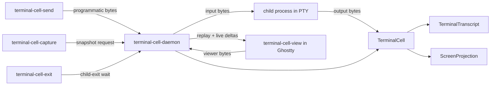

# terminal-cell - architecture

*Prototype durable terminal cell: one PTY owner, one transcript, disposable
viewers.*

---

## 0 - TL;DR

`terminal-cell` tests whether a daemon-owned terminal cell can preserve
native terminal behavior while still supporting reattachment with scrollback,
programmatic input injection, and GUI terminal viewers.

The cell owns the child process group and PTY. Output bytes from the PTY master
are appended to transcript truth before any viewer receives them. Viewers are
subscribers: they replay prior transcript, then receive live deltas. Screen
state is derived from transcript bytes and is never the source of truth.



## 1 - Components

- `TerminalCell` - Kameo actor that owns the PTY writer, transcript, resize
  authority, live subscribers, and waiters.
- `TerminalTranscript` - append-only output log, sequenced by
  `TerminalSequence`.
- `TranscriptSubscription` - replay plus live delta receiver for a viewer.
- `ScreenProjection` - derived `vt100` snapshot over transcript bytes.
- `TerminalInput` - raw bytes plus source provenance, written to the PTY.
- `TerminalExit` - recorded child status, observable through the actor and
  socket protocol without polling the child process.
- `TerminalCellSocketClient` - thin Unix-socket client used by command-line
  tools and viewers.
- `terminal-cell-daemon` - daemon that owns the `TerminalCell` actor and
  serves socket requests.
- `terminal-cell-send` / `capture` / `wait` / `exit` - thin command-line
  clients.
- `terminal-cell-view` - attach client that replays transcript, subscribes
  live, enables raw mode, and forwards keyboard bytes to the daemon.
- `agent-terminal-fixture` - deterministic agent-like terminal process used by
  the stateful witness.

## 2 - State and Ownership

The daemon owns the root actor. Command-line tools and GUI viewers are clients:
they parse arguments, send one socket request or open one subscription, render
the reply, and exit or remain attached. The daemon waits for Kameo actor
startup before binding/announcing the socket so clients cannot race the actor
lifecycle.

The actor owns mutable terminal state. Blocking PTY reads and child wait run in
dedicated OS threads that push typed messages back to the actor. The transcript
is owned by the actor, not by those threads, not by a viewer, and not by a CLI.

## 3 - Constraints

- A terminal cell owns one child process group and PTY for the lifetime of the
  session.
- Output emitted while no viewer is subscribed is still appended to transcript
  truth.
- A late viewer receives replayed transcript before live deltas.
- Programmatic input and viewer keyboard input enter through the same input
  port.
- Terminal input is raw bytes; slash commands are not parsed by the terminal
  owner.
- Screen snapshots are derived from transcript bytes.
- Blocking PTY reads are isolated outside actor handlers and push messages into
  the actor mailbox.
- CLIs are daemon clients; they do not own the runtime or transcript.
- Child exit is actor state; clients wait on the terminal cell instead of
  polling process tables.
- A GUI terminal attaches by running the view client as the terminal command.
- Ghostty witnesses use the app ID/class
  `com.ligoldragon.terminalcellwitness` so Niri can target the window with
  `open-focused false`.
- Viewer readiness is a pushed event from the attached view process, not a
  polling sleep.

## 4 - Witnesses

- `detached_output_is_replayed_to_late_subscriber`
- `programmatic_input_uses_the_same_pty_input_port`
- `screen_projection_is_derived_from_transcript`
- `terminal_exit_is_observable_without_polling_the_child`
- `agent_terminal_accepts_prompt_and_terminal_cell_reads_response`
- `agent_terminal_usage_probe_is_prompt_input_not_terminal_semantics`
- `daemon_accepts_programmatic_prompt_and_capture_reads_transcript`
- `attach_view_replays_transcript_without_owning_the_child`
- `daemon_exposes_terminal_exit_status`
- `nix run .#live-coding-agent-witness` starts the real Codex CLI by default,
  injects a prompt through the daemon socket, waits for the model response
  marker that is not present in the injected prompt, and captures the
  transcript artifact. The witness sends Enter as a separate PTY write after
  the prompt echo; coalescing prompt text and submit into one write is not a
  faithful enough model for this TUI.
- `nix run .#ghostty-agent-witness` opens Ghostty, waits for view attachment,
  injects a prompt through the daemon, waits for the response, and captures the
  transcript artifact.
- `nix run .#ghostty-agent-session` opens a durable Ghostty view backed by a
  daemon and leaves session files under
  `${XDG_RUNTIME_DIR:-/tmp}/terminal-cell/session-*`.

## Code Map

```text
src/lib.rs        public surface
src/error.rs      typed errors
src/session.rs    TerminalCell actor and terminal records
src/socket.rs     tiny Unix-socket request/reply protocol
src/client.rs     thin socket client used by CLIs/viewers
src/snapshot.rs   vt100 screen projection
src/bin/          daemon, clients, view, and deterministic fixture
tests/            architecture witnesses
```
