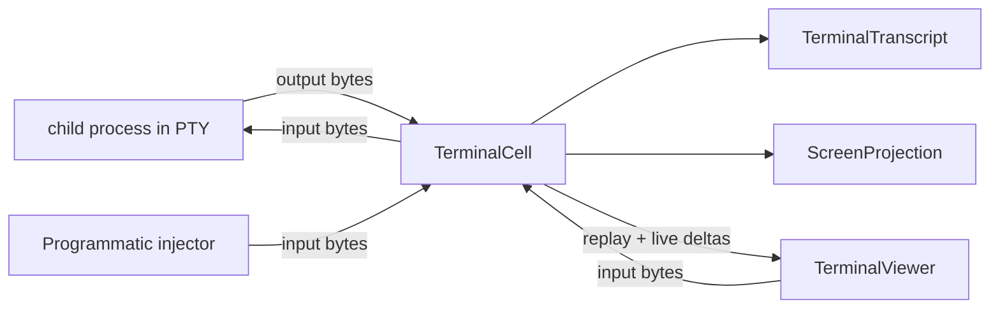

# terminal-cell-lab - architecture

*Prototype durable terminal cell: one PTY owner, one transcript, disposable
viewers.*

---

## 0 - TL;DR

`terminal-cell-lab` tests whether a small terminal owner can preserve native
terminal behavior while still supporting reattachment with scrollback and
programmatic input injection.

The cell owns the child process group and PTY. Output bytes from the PTY master
are appended to transcript truth before any viewer receives them. Viewers are
subscribers: they replay prior transcript, then receive live deltas. Screen
state is derived from transcript bytes and is never the source of truth.



## 1 - Components

- `TerminalCell` - Kameo actor that owns the PTY writer, transcript, resize
  authority, live subscribers, and waiters.
- `TerminalTranscript` - append-only output log, sequenced by
  `TerminalSequence`.
- `TranscriptSubscription` - replay plus live delta receiver for a viewer.
- `ScreenProjection` - derived `vt100` snapshot over transcript bytes.
- `TerminalInput` - raw bytes plus source provenance, written to the PTY.

## 2 - State and Ownership

The actor owns mutable terminal state. Blocking PTY reads and child wait run in
dedicated OS threads that push typed messages back to the actor. The transcript
is owned by the actor, not by those threads and not by a viewer.

## 3 - Constraints

- A terminal cell owns one child process group and PTY for the lifetime of the
  session.
- Output emitted while no viewer is subscribed is still appended to transcript
  truth.
- A late viewer receives replayed transcript before live deltas.
- Programmatic input and viewer keyboard input enter through the same input
  port.
- Terminal input is raw bytes; slash commands are not parsed by the terminal
  owner.
- Screen snapshots are derived from transcript bytes.
- Blocking PTY reads are isolated outside actor handlers and push messages into
  the actor mailbox.

## 4 - Witnesses

- `detached_output_is_replayed_to_late_subscriber`
- `programmatic_input_uses_the_same_pty_input_port`
- `screen_projection_is_derived_from_transcript`

## Code Map

```text
src/lib.rs        public surface
src/error.rs      typed errors
src/session.rs    TerminalCell actor and terminal records
src/snapshot.rs   vt100 screen projection
tests/            architecture witnesses
```

